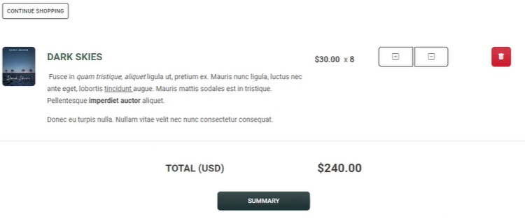

## Esempio di View



UI consente di visualizzare una lista di prodotti,
per ogni prodotto aumentare la quantità , diminuirla o cancellarli dalla lista
inolte fornisce il totale degli acquisti
il pulsante finale per la spedizione

Viene creata una ModelView contenente una lista dei prodotti acquistati e la loro quantati.
Un controller per poi gestire le azioni sulla lista.

```Csharp

    [Area("Customer")]
    public class CartController : Controller
    {
        private readonly IUnitOfWork _unitOfWork;
        private readonly IEmailSender _emailSender;

        private TwilioSettings _twilioOptions { get; set; }
        private readonly UserManager<IdentityUser> _userManager;

        [BindProperty]
        public ShoppingCartVM ShoppingCartVM { get; set; }

        public CartController(IUnitOfWork unitOfWork, IEmailSender emailSender,
            UserManager<IdentityUser> userManager, IOptions<TwilioSettings> twilionOptions)
        {
            _unitOfWork = unitOfWork;
            _emailSender = emailSender;
            _userManager = userManager;
            _twilioOptions = twilionOptions.Value;
        }

          // Ricerca il prodotto e poi lo incrementa di uno

       public IActionResult Plus(int cartId)
        {
            var cart = _unitOfWork.ShoppingCart.GetFirstOrDefault
                            (c => c.Id == cartId, includeProperties: "Product");
            cart.Count += 1;
            cart.Price = SD.GetPriceBasedOnQuantity(cart.Count, cart.Product.Price,
                                    cart.Product.Price50, cart.Product.Price100);
            _unitOfWork.Save();
            return RedirectToAction(nameof(Index));
        }

        public IActionResult Minus(int cartId)
        {
            var cart = _unitOfWork.ShoppingCart.GetFirstOrDefault
                            (c => c.Id == cartId, includeProperties: "Product");

            if (cart.Count == 1)
            {
                var cnt = _unitOfWork.ShoppingCart.GetAll(u => u.ApplicationUserId == cart.ApplicationUserId).ToList().Count;
                _unitOfWork.ShoppingCart.Remove(cart);
                _unitOfWork.Save();
                HttpContext.Session.SetInt32(SD.ssShoppingCart, cnt - 1);
            }
            else
            {
                cart.Count -= 1;
                cart.Price = SD.GetPriceBasedOnQuantity(cart.Count, cart.Product.Price,
                                    cart.Product.Price50, cart.Product.Price100);
                _unitOfWork.Save();
            }

            return RedirectToAction(nameof(Index));
        }

// Rimuove gli elementi
        public IActionResult Remove(int cartId)
        {
            var cart = _unitOfWork.ShoppingCart.GetFirstOrDefault
                            (c => c.Id == cartId, includeProperties: "Product");

            var cnt = _unitOfWork.ShoppingCart.GetAll(u => u.ApplicationUserId == cart.ApplicationUserId).ToList().Count;
            _unitOfWork.ShoppingCart.Remove(cart);
            _unitOfWork.Save();
            HttpContext.Session.SetInt32(SD.ssShoppingCart, cnt - 1);


            return RedirectToAction(nameof(Index));
        }

        public IActionResult Summary()
        {
            var claimsIdentity = (ClaimsIdentity)User.Identity;
            var claim = claimsIdentity.FindFirst(ClaimTypes.NameIdentifier);

            ShoppingCartVM = new ShoppingCartVM()
            {
                OrderHeader = new Models.OrderHeader(),
                ListCart = _unitOfWork.ShoppingCart.GetAll(c => c.ApplicationUserId == claim.Value,
                                                            includeProperties: "Product")
            };

            ShoppingCartVM.OrderHeader.ApplicationUser = _unitOfWork.ApplicationUser
                                                            .GetFirstOrDefault(c => c.Id == claim.Value,
                                                                includeProperties: "Company");

            foreach (var list in ShoppingCartVM.ListCart)
            {
                list.Price = SD.GetPriceBasedOnQuantity(list.Count, list.Product.Price,
                                                    list.Product.Price50, list.Product.Price100);
                ShoppingCartVM.OrderHeader.OrderTotal += (list.Price * list.Count);
            }
            ShoppingCartVM.OrderHeader.Name = ShoppingCartVM.OrderHeader.ApplicationUser.Name;
            ShoppingCartVM.OrderHeader.PhoneNumber = ShoppingCartVM.OrderHeader.ApplicationUser.PhoneNumber;
            ShoppingCartVM.OrderHeader.StreetAddress = ShoppingCartVM.OrderHeader.ApplicationUser.StreetAddress;
            ShoppingCartVM.OrderHeader.City = ShoppingCartVM.OrderHeader.ApplicationUser.City;
            ShoppingCartVM.OrderHeader.State = ShoppingCartVM.OrderHeader.ApplicationUser.State;
            ShoppingCartVM.OrderHeader.PostalCode = ShoppingCartVM.OrderHeader.ApplicationUser.PostalCode;

            return View(ShoppingCartVM);
        }

        [HttpPost]
        [ActionName("Summary")]
        [ValidateAntiForgeryToken]
        public IActionResult SummaryPost(string stripeToken)
        {
            var claimsIdentity = (ClaimsIdentity)User.Identity;
            var claim = claimsIdentity.FindFirst(ClaimTypes.NameIdentifier);
            ShoppingCartVM.OrderHeader.ApplicationUser = _unitOfWork.ApplicationUser
                                                            .GetFirstOrDefault(c => c.Id == claim.Value,
                                                                    includeProperties: "Company");

            ShoppingCartVM.ListCart = _unitOfWork.ShoppingCart
                                        .GetAll(c => c.ApplicationUserId == claim.Value,
                                        includeProperties: "Product");

            ShoppingCartVM.OrderHeader.PaymentStatus = SD.PaymentStatusPending;
            ShoppingCartVM.OrderHeader.OrderStatus = SD.StatusPending;
            ShoppingCartVM.OrderHeader.ApplicationUserId = claim.Value;
            ShoppingCartVM.OrderHeader.OrderDate = DateTime.Now;

            _unitOfWork.OrderHeader.Add(ShoppingCartVM.OrderHeader);
            _unitOfWork.Save();

            foreach (var item in ShoppingCartVM.ListCart)
            {
                item.Price = SD.GetPriceBasedOnQuantity(item.Count, item.Product.Price,
                    item.Product.Price50, item.Product.Price100);
                OrderDetails orderDetails = new OrderDetails()
                {
                    ProductId = item.ProductId,
                    OrderId = ShoppingCartVM.OrderHeader.Id,
                    Price = item.Price,
                    Count = item.Count
                };
                ShoppingCartVM.OrderHeader.OrderTotal += orderDetails.Count * orderDetails.Price;
                _unitOfWork.OrderDetails.Add(orderDetails);

            }

            _unitOfWork.ShoppingCart.RemoveRange(ShoppingCartVM.ListCart);
            _unitOfWork.Save();
            HttpContext.Session.SetInt32(SD.ssShoppingCart, 0);

            if (stripeToken == null)
            {
                //order will be created for delayed payment for authroized company
                ShoppingCartVM.OrderHeader.PaymentDueDate = DateTime.Now.AddDays(30);
                ShoppingCartVM.OrderHeader.PaymentStatus = SD.PaymentStatusDelayedPayment;
                ShoppingCartVM.OrderHeader.OrderStatus = SD.StatusApproved;
            }
            else
            {
                //process the payment
                var options = new ChargeCreateOptions
                {
                    Amount = Convert.ToInt32(ShoppingCartVM.OrderHeader.OrderTotal * 100),
                    Currency = "usd",
                    Description = "Order ID : " + ShoppingCartVM.OrderHeader.Id,
                    Source = stripeToken
                };

                var service = new ChargeService();
                Charge charge = service.Create(options);

                if (charge.Id == null)
                {
                    ShoppingCartVM.OrderHeader.PaymentStatus = SD.PaymentStatusRejected;
                }
                else
                {
                    ShoppingCartVM.OrderHeader.TransactionId = charge.Id;
                }
                if (charge.Status.ToLower() == "succeeded")
                {
                    ShoppingCartVM.OrderHeader.PaymentStatus = SD.PaymentStatusApproved;
                    ShoppingCartVM.OrderHeader.OrderStatus = SD.StatusApproved;
                    ShoppingCartVM.OrderHeader.PaymentDate = DateTime.Now;
                }
            }

            _unitOfWork.Save();

            return RedirectToAction("OrderConfirmation", "Cart", new { id = ShoppingCartVM.OrderHeader.Id });

        }

        public IActionResult OrderConfirmation(int id)
        {
            OrderHeader orderHeader = _unitOfWork.OrderHeader.GetFirstOrDefault(u => u.Id == id);
            TwilioClient.Init(_twilioOptions.AccountSid, _twilioOptions.AuthToken);
            try
            {
                var message = MessageResource.Create(
                    body: "Order Placed on Bulky Book. Your Order ID:" + id,
                    from: new Twilio.Types.PhoneNumber(_twilioOptions.PhoneNumber),
                    to: new Twilio.Types.PhoneNumber(orderHeader.PhoneNumber)
                    );
            }
            catch (Exception ex)
            {

            }

            return View(id);
        }
    }
```
